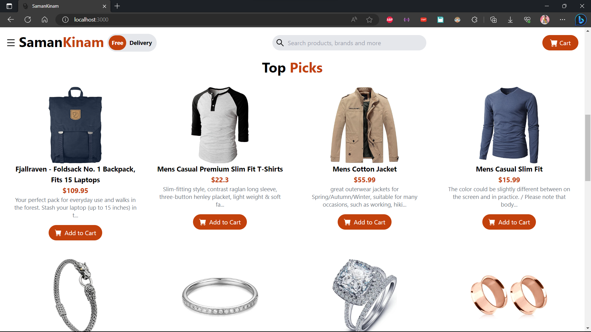

# Getting Started with Create React App

## Available Scripts

In the project directory, you can run:

### `npm start`

Runs the app in the development mode.\
Open [http://localhost:3000](http://localhost:3000) to view it in your browser.

The page will reload when you make changes.\
You may also see any lint errors in the console.

### `npm test`

Launches the test runner in the interactive watch mode.\

### `npm run build`

Builds the app for production to the `build` folder.\
It correctly bundles React in production mode and optimizes the build for the best performance.

The build is minified and the filenames include the hashes.\
Your app is ready to be deployed!

### `npm run eject`

**Note: this is a one-way operation. Once you `eject`, you can't go back!**

If you aren't satisfied with the build tool and configuration choices, you can `eject` at any time. This command will remove the single build dependency from your project.

Instead, it will copy all the configuration files and the transitive dependencies (webpack, Babel, ESLint, etc) right into your project so you have full control over them. All of the commands except `eject` will still work, but they will point to the copied scripts so you can tweak them. At this point you're on your own.

You don't have to ever use `eject`. The curated feature set is suitable for small and middle deployments, and you shouldn't feel obligated to use this feature. However we understand that this tool wouldn't be useful if you couldn't customize it when you are ready for it.

### E-COMMERCE WEBSITE ENTITLED "SAMANKINAM" PROJECT STARTS

# Every Commits Explanation.

1.  "Remove boilerplates and start from scratch"
    

2.  "Update icons and Insert Building components"
    

3.  "Install tailwindcss"
    => commands used.
    i. npm install -D tailwindcss
    ii. npx tailwindcss init

4.  "Update component TopNav and SideNav"
    
    

5.  "Add Feature component with a slider and use of API"
    

6.  "Use of API to the SideNav"

7.  "Add component About Us and Make navbar and sidebar sticky"
    
    => also, made the nav and side bar sticky

8.  "Add component Top Picks"
    

9.  "Update Top Picks component to Our Products with some functionality"
    

10. "Add Trendy Categories component"
    

11. "Build Contact us component"
    

12. "Build Footer component"
    

13. "Redesign Scrollbar"
    

14. "Update and add functionality to the add to cart"
    

15. "Add domain name to the website and hosted with the help of github"
    => Deployed with : github
    => Deployed Live URL : https://www.purnashrestha.com.np/SamanKinam/

16. "Fix build and host issues"
    
    => Deployed with : cloudflare
    => Deployed Live URL : https://samankinam.pages.dev/

17. "Update the component your cart with a mathematical total calculation and functionality"
    => 
    => 
